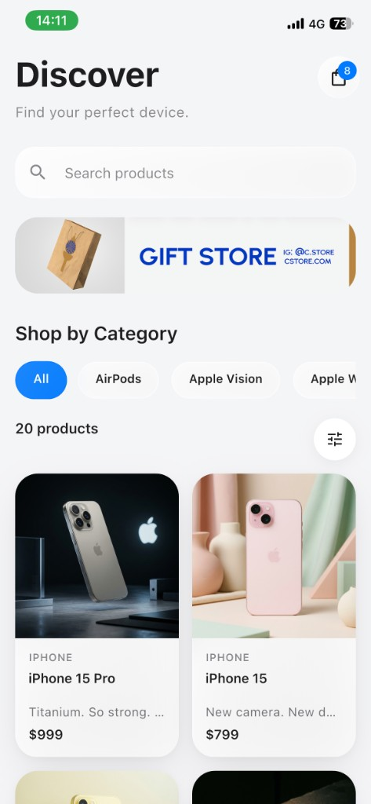
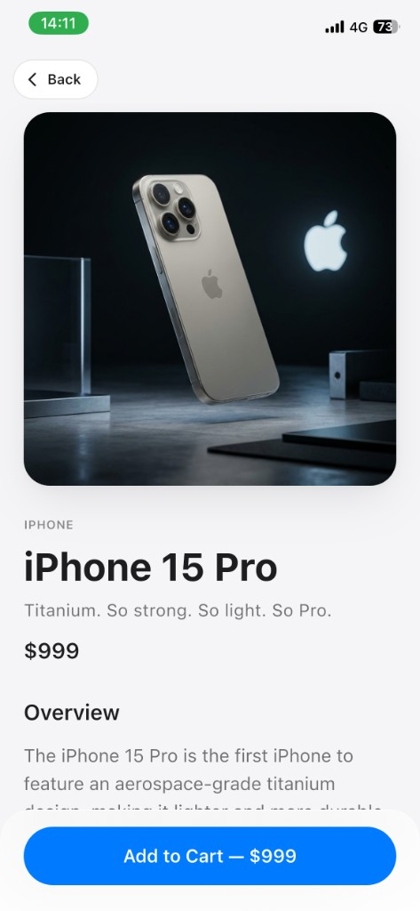
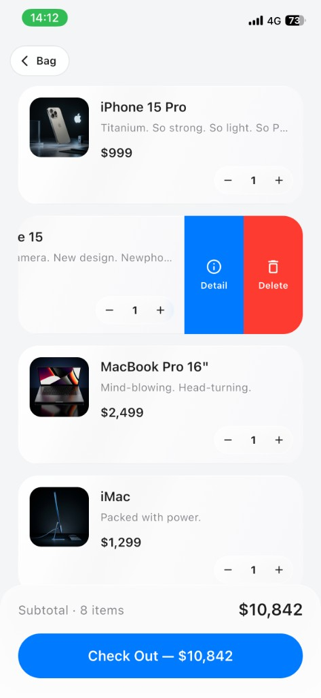

# VeloCatalog

Apple Store tarzında tasarlanmış mini katalog uygulaması. Ürünleri keşfedin, detaylarını inceleyin ve sepetinizi yönetin.

<p align="center">
  
  &nbsp;
  
  &nbsp;
  
</p>

<p align="center">
  <sub><b>Discover</b> &nbsp;·&nbsp; <b>Ürün Detay</b> &nbsp;·&nbsp; <b>Sepet</b></sub>
</p>

## Kısa Açıklama

VeloCatalog, Flutter ile geliştirilmiş bir ürün katalog uygulamasıdır. Kullanıcılar ürünleri arayabilir, kategorilere göre filtreleyebilir, sıralayabilir, ürün detay sayfasından sepete ekleyebilir ve sepet ekranında miktar güncelleyebilir veya kaydırarak detay/silme işlemlerini gerçekleştirebilir.

**Öne çıkan özellikler:**

- Discover ekranı: arama, kategori filtreleri, sıralama paneli, ürün grid'i
- Ürün detay sayfası: görsel, açıklama ve sepete ekleme
- Sepet ekranı: miktar adımı, swipe ile detay/sil, ödeme özeti
- Liquid glass arayüz: shader tabanlı cam efekti (filtre paneli), buzlu yüzeyler

## Flutter Sürümü

Bu proje aşağıdaki sürümle geliştirilmiş ve test edilmiştir:

| Araç | Sürüm |
|------|-------|
| **Flutter** | 3.38.9 (stable) |
| **Dart** | 3.10.8 |

`pubspec.yaml` içinde SDK gereksinimi: `^3.10.8`

## Gereksinimler

- [Flutter SDK](https://docs.flutter.dev/get-started/install) (3.38.x veya uyumlu Dart 3.10+)
- iOS Simulator / Android Emulator veya fiziksel cihaz
- iOS için: Xcode 15+ (fiziksel cihaz veya simulator build için)

## Çalıştırma Adımları

1. Depoyu klonlayın veya proje klasörüne gidin:

```bash
cd VeloCatalog
```

2. Bağımlılıkları yükleyin:

```bash
flutter pub get
```

3. Bağlı cihazları kontrol edin:

```bash
flutter devices
```

4. Uygulamayı çalıştırın:

```bash
flutter run
```

**iOS (release, shader desteği için önerilir):**

```bash
flutter run --release
```

**Android:**

```bash
flutter run
```

5. (İsteğe bağlı) Statik analiz:

```bash
flutter analyze
```

## Proje Yapısı

```
lib/
├── main.dart                 # Uygulama girişi ve sepet state yönetimi
├── data/                     # Ürün modeli ve mock veri
├── screens/                  # Discover, detay ve sepet ekranları
├── widgets/                  # Kartlar, liquid glass bileşenleri
├── liquid_glass/             # Shader capture modülü
└── theme/                    # Apple tarzı tema ve tipografi

assets/
├── data/products.json
└── images/

shaders/
└── liquid_glass_lens.frag    # Cam efekti fragment shader
```

## Lisans

Bu proje eğitim / portföy amaçlıdır.
